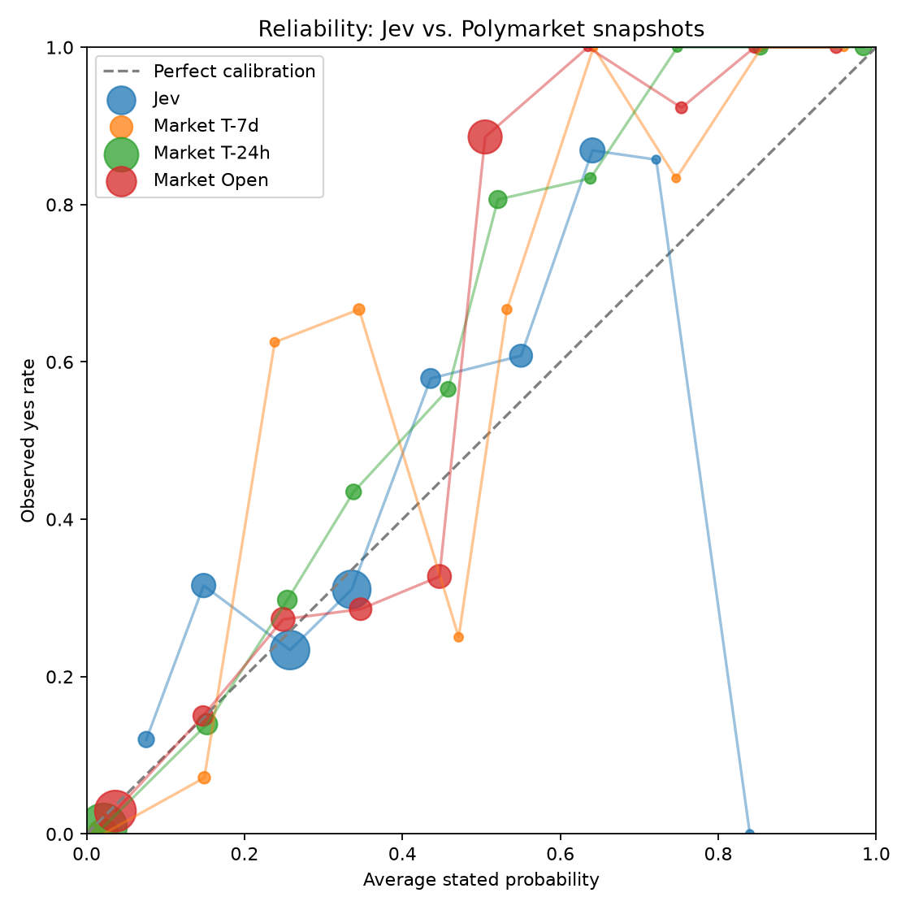

# Jev vs. Polymarket results

_Run: `full`. Model: `jev-1.13.0`. Markets: 542. Total cost: $0.019493._

## Headline

Best market snapshot beats Jev on Brier (0.0822 vs 0.2040).

## Leaderboard

| model | n | brier | skill | ece | auc |
| --- | --- | --- | --- | --- | --- |
| Jev | 542 | 0.2040 | 0.1477 | 0.0777 | 0.7123 |
| Market open | 531 | 0.1389 | 0.4196 | 0.1183 | 0.9162 |
| Market T-7d | 162 | 0.0835 | 0.6511 | 0.0975 | 0.9551 |
| Market T-24h | 454 | 0.0822 | 0.6566 | 0.0593 | 0.9602 |

## Reliability

### Jev reliability bins

| bin | n | avg_prob | observed | gap |
| --- | --- | --- | --- | --- |
| 0.0-0.1 | 25 | 0.0756 | 0.1200 | 0.0444 |
| 0.1-0.2 | 57 | 0.1482 | 0.3158 | 0.1675 |
| 0.2-0.3 | 154 | 0.2577 | 0.2338 | -0.0239 |
| 0.3-0.4 | 148 | 0.3357 | 0.3108 | -0.0249 |
| 0.4-0.5 | 38 | 0.4358 | 0.5789 | 0.1432 |
| 0.5-0.6 | 51 | 0.5502 | 0.6078 | 0.0576 |
| 0.6-0.7 | 61 | 0.6407 | 0.8689 | 0.2282 |
| 0.7-0.8 | 7 | 0.7214 | 0.8571 | 0.1357 |
| 0.8-0.9 | 1 | 0.8400 | 0 | -0.8400 |

## Routing table

| margin | auto_n | auto_share | auto_error_rate | flagged_n | flagged_error_rate |
| --- | --- | --- | --- | --- | --- |
| 0.0000 | 542 | 1.0000 | 0.2860 | 0 | 0 |
| 0.1000 | 448 | 0.8266 | 0.2500 | 94 | 0.4574 |
| 0.2000 | 255 | 0.4705 | 0.2392 | 287 | 0.3275 |
| 0.3000 | 89 | 0.1642 | 0.2809 | 453 | 0.2870 |
| 0.4000 | 31 | 0.0572 | 0.0968 | 511 | 0.2975 |
| 0.4500 | 2 | 0.0037 | 0.0000 | 540 | 0.2870 |
| 0.4900 | 0 | 0.0000 | 0 | 542 | 0.2860 |

## Category breakdown

| jev_category | n | yes_rate | brier | ece | auc |
| --- | --- | --- | --- | --- | --- |
| crypto_price | 75 | 0.5333 | 0.3082 | 0.2824 | 0.6621 |
| entertainment_culture | 10 | 0.7000 | 0.5353 | 0.6400 | 0.6667 |
| finance_macro | 40 | 1 | 0.4215 | 0.6415 | n/a |
| other | 179 | 0.1453 | 0.1633 | 0.1695 | 0.3913 |
| politics | 134 | 0.1269 | 0.1356 | 0.1828 | 0.7283 |
| sports | 104 | 0.8173 | 0.1714 | 0.2761 | 0.8025 |

## Numeric-threshold breakdown

| numeric_threshold_bucket | n | yes_rate | brier | ece | auc |
| --- | --- | --- | --- | --- | --- |
| not_numeric | 16 | 0.3125 | 0.2250 | 0.1619 | 0.6545 |
| numeric | 526 | 0.3992 | 0.2033 | 0.0797 | 0.7136 |

## Leakage split by close month

| close_month | n | yes_rate | brier | ece | auc |
| --- | --- | --- | --- | --- | --- |
| 2026-09 | 542 | 0.3967 | 0.2040 | 0.0777 | 0.7123 |

## Largest Jev vs. T-7d market disagreements

| id | question | resolved_yes | jev_resolve_yes | market_price_7d | delta | jev_right | market_right |
| --- | --- | --- | --- | --- | --- | --- | --- |
| 3665860 | Exact Score: SC Lourel 0 - 0 SC Angrense? | 1 | 0.1500 | 0.9815 | -0.8315 | 0 | 1 |
| 3393117 | Will Linke win fewer than 20 seats in the 2026 Berlin state elections? | 0 | 0.6900 | 0.0015 | 0.6885 | 0 | 1 |
| 3393069 | Will Linke win the third-most seats in the 2026 Mecklenburg-Vorpommern parliamentary el... | 1 | 0.2700 | 0.8950 | -0.6250 | 0 | 1 |
| 3748579 | Will AfD win less than 32% of all valid second votes? | 0 | 0.7000 | 0.0935 | 0.6065 | 0 | 1 |
| 4008559 | Will Independiente Santa Fe win on 2026-09-13? | 1 | 0.3700 | 0.9705 | -0.6005 | 0 | 1 |
| 3748593 | Will CDU win at least 14% of all valid second votes? | 0 | 0.6000 | 0.0060 | 0.5940 | 0 | 1 |
| 3393156 | Will AfD win fewer than 20 seats in the 2026 Berlin state elections? | 0 | 0.5800 | 0.0130 | 0.5670 | 0 | 1 |
| 3393043 | Will SPD win the second-most seats in the 2026 Mecklenburg-Vorpommern parliamentary ele... | 1 | 0.2600 | 0.8150 | -0.5550 | 0 | 1 |
| 3504051 | Will CDU win fewer than 25 seats in the 2026 Berlin state elections? | 0 | 0.5600 | 0.0130 | 0.5470 | 0 | 1 |
| 3393094 | Will SPD win fewer than 18 seats in the 2026 Mecklenburg-Vorpommern parliamentary elect... | 0 | 0.5500 | 0.0060 | 0.5440 | 0 | 1 |
| 4199127 | Will "Resident Evil" score at least 80 on the Rotten Tomatoes Tomatometer? | 1 | 0.2000 | 0.7300 | -0.5300 | 0 | 1 |
| 3748340 | Will Linke win less than 17% of all valid second votes? | 0 | 0.5400 | 0.0305 | 0.5095 | 0 | 1 |
| 2046123 | Will the Communist Party of the Russian Federation (KPRF) win the second-most seats in ... | 1 | 0.4000 | 0.9050 | -0.5050 | 0 | 1 |
| 3748355 | Will SPD win at least 16% of all valid second votes? | 0 | 0.5100 | 0.0075 | 0.5025 | 0 | 1 |
| 4199128 | Will "Resident Evil" score at least 85 on the Rotten Tomatoes Tomatometer? | 1 | 0.1500 | 0.6500 | -0.5000 | 0 | 1 |
| 3748601 | Will BSW win at least 7% of all valid second votes? | 0 | 0.5000 | 0.0120 | 0.4880 | 0 | 1 |
| 3748344 | Will AfD win less than 14% of all valid second votes? | 0 | 0.5000 | 0.0240 | 0.4760 | 0 | 1 |
| 1125102 | Will United Russia win between 295 and 309 seats in the next Russian State Duma election? | 0 | 0.5100 | 0.0430 | 0.4670 | 0 | 1 |
| 3393088 | Will AfD win fewer than 20 seats in the 2026 Mecklenburg-Vorpommern parliamentary elect... | 0 | 0.4600 | 0.0035 | 0.4565 | 1 | 1 |
| 1125101 | Will United Russia win between 280 and 294 seats in the next Russian State Duma election? | 0 | 0.4500 | 0.0165 | 0.4335 | 1 | 1 |

## Scope

- Retrospective resolved Polymarket markets; no trading signal is implied.
- v0 input is question + resolution rules only. No news or outside context.
- Older resolved markets may be in model training data; close-month split is included to inspect leakage.
- Market prices are strong but imperfect calibration baselines, especially on low-liquidity or grouped markets.
