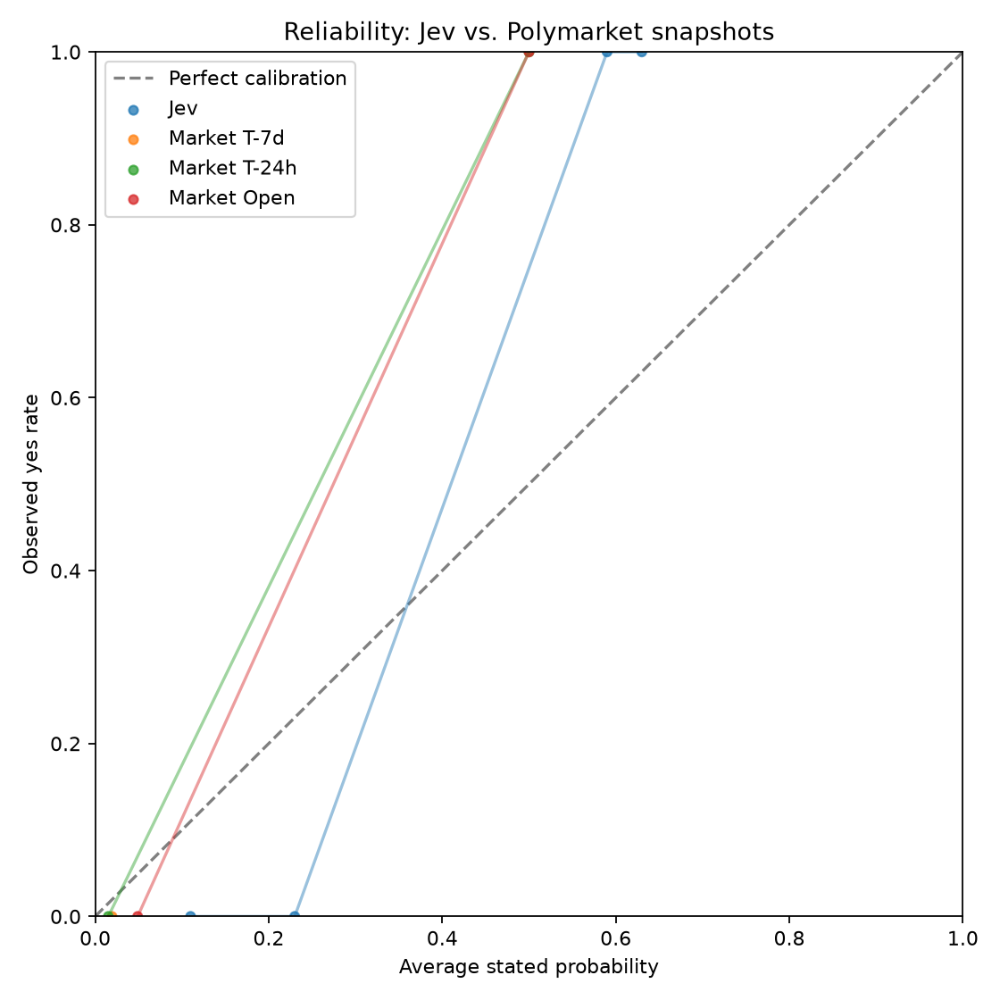

# Jev vs. Polymarket results

_Run: `validation`. Model: `jev-1.13.0`. Markets: 10. Total cost: $0.000323._

## Headline

Best market snapshot beats Jev on Brier (0.0005 vs 0.0694).

## Leaderboard

| model | n | brier | skill | ece | auc |
| --- | --- | --- | --- | --- | --- |
| Jev | 10 | 0.0694 | 0.7108 | 0.2300 | 1.0000 |
| Market open | 10 | 0.1016 | 0.5765 | 0.2294 | 1.0000 |
| Market T-7d | 6 | 0.0005 | 0.9978 | 0.0191 | n/a |
| Market T-24h | 7 | 0.0362 | 0.8492 | 0.0844 | 1.0000 |

## Reliability

### Jev reliability bins

| bin | n | avg_prob | observed | gap |
| --- | --- | --- | --- | --- |
| 0.1-0.2 | 5 | 0.1100 | 0 | -0.1100 |
| 0.2-0.3 | 1 | 0.2300 | 0 | -0.2300 |
| 0.5-0.6 | 1 | 0.5900 | 1 | 0.4100 |
| 0.6-0.7 | 3 | 0.6300 | 1 | 0.3700 |

## Routing table

| margin | auto_n | auto_share | auto_error_rate | flagged_n | flagged_error_rate |
| --- | --- | --- | --- | --- | --- |
| 0.0000 | 10 | 1.0000 | 0.0000 | 0 | 0 |
| 0.1000 | 9 | 0.9000 | 0.0000 | 1 | 0.0000 |
| 0.2000 | 6 | 0.6000 | 0.0000 | 4 | 0.0000 |
| 0.3000 | 5 | 0.5000 | 0.0000 | 5 | 0.0000 |
| 0.4000 | 2 | 0.2000 | 0.0000 | 8 | 0.0000 |
| 0.4500 | 0 | 0.0000 | 0 | 10 | 0.0000 |
| 0.4900 | 0 | 0.0000 | 0 | 10 | 0.0000 |

## Category breakdown

| jev_category | n | yes_rate | brier | ece | auc |
| --- | --- | --- | --- | --- | --- |
| politics | 6 | 0 | 0.0190 | 0.1300 | n/a |
| sports | 4 | 1 | 0.1451 | 0.3800 | n/a |

## Numeric-threshold breakdown

| numeric_threshold_bucket | n | yes_rate | brier | ece | auc |
| --- | --- | --- | --- | --- | --- |
| numeric | 10 | 0.4000 | 0.0694 | 0.2300 | 1.0000 |

## Leakage split by close month

| close_month | n | yes_rate | brier | ece | auc |
| --- | --- | --- | --- | --- | --- |
| 2026-09 | 10 | 0.4000 | 0.0694 | 0.2300 | 1.0000 |

## Largest Jev vs. T-7d market disagreements

_No rows._

## Scope

- Retrospective resolved Polymarket markets; no trading signal is implied.
- v0 input is question + resolution rules only. No news or outside context.
- Older resolved markets may be in model training data; close-month split is included to inspect leakage.
- Market prices are strong but imperfect calibration baselines, especially on low-liquidity or grouped markets.
